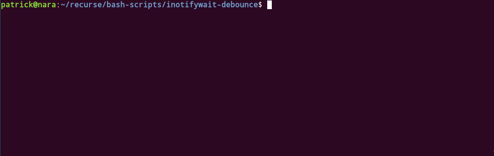

# 🎱 debounce.sh
## A generic debounce for Bash.



__Debouncing__ is the process of taking multiple sequential events of the same type and grouping them together as one. By treating a group of events as one event, you can handle them all at once instead of handling each event individually.

Debounce is often used in front-end design for things like autosaving a form that a user is typing in - but only after they have finished typing for some time (all keypress events are grouped together and treated as one).

Debouncing requires an event generating __program__ and an __action__ to run when the event generating program has not generated an event for a certain __time interval__.

### Usage

Pass three parameters to `debounce.sh`:
1) `DEBOUNCE_PROGRAM`: a program that you want to run continuously but that periodically returns successfully when an event occurs (ex a file watcher like `inotifywait` that returns successfully when a file is changed).
2) `DEBOUNCE_INTERVAL_SECONDS`: a time interval in seconds to wait when the debounce program returns successfully
3) `DEBOUNCE_ACTION`: a program that runs when the `DEBOUNCE_PROGRAM` has not generated new events for `DEBOUNCE_INTERVAL_SECONDS` seconds.

Generic usage:

```
./debounce.sh ./debounce_program.sh debounce_interval_seconds ./debounce_action.sh
```

Watch standard input and print "Ran action" whenever text has been submitted to standard input but not submitted again for 5 seconds
```
./debounce.sh "read" 5 "echo 'Ran action'"
```
Watch my technical journal file and run an action whenever it has been saved but not saved again for 10 seconds

```
./debounce.sh ./inotifywait-debounce.sh 10 ./action.sh
```

### Tests

Tests are written with [Bash Automated Testing Systems 2018 (bats-core)](https://github.com/bats-core/bats-core).

Run tests in `test/`:

```
bats test.bats
```
